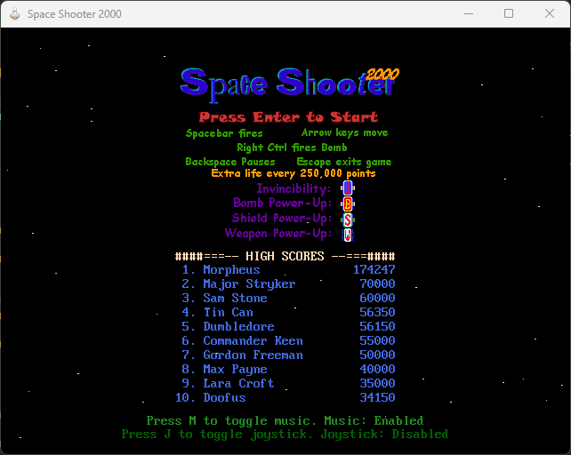
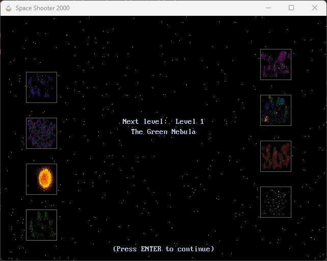
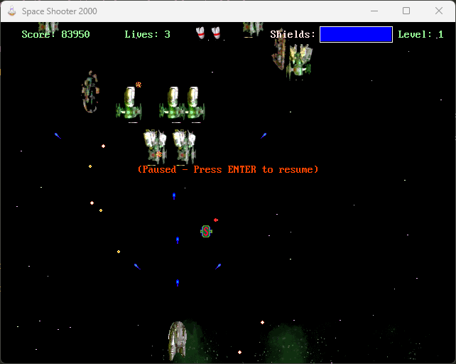

# SPACE SHOOTER 2000

This is a [QB64-PE](https://www.qb64phoenix.com) source port of the [Space Shooter 2000](https://github.com/a740g/SpaceShooter2K) game originally written in [Visual Basic 6](https://winworldpc.com/product/microsoft-visual-bas/60) and distributed with Microsoft's [DirectX 7 SDK](https://github.com/oxiKKK/dx7sdk).






The original [Visual Basic 6](https://winworldpc.com/product/microsoft-visual-bas/60) source code is available [here](https://github.com/oxiKKK/dx7sdk/tree/main/dx7sdk-700.1/samples/multimedia/vbsamples/dxmisc/src/spaceshooter) and [here](https://github.com/orbitersim/orbiter/tree/main/Extern/mssdk_dx7/samples/Multimedia/VBSamples/DXMisc/src/SpaceShooter).

## FEATURES

- Native support for Windows, Linux, and macOS.
- No dependencies on [DirectX](https://en.wikipedia.org/wiki/DirectX).
- Leverages native [QB64-PE](https://www.qb64phoenix.com) graphics and sound functions.
- Runs in 32-bit color (32bpp) mode, unlike the original 8-bit color (8bpp) mode.
- MIDI playback handled using QB64-PE's built-in MIDI support.
- No sound buffer copy limitations, unlike the original version.
- Supports fullscreen toggle with `Alt + Enter`.

## USAGE

1. Clone the repository to your desired directory:

    ```sh
    git clone https://github.com/a740g/SpaceShooter2K.git
    ```

2. Open a terminal and navigate to the repository directory.
3. Initialize the submodules:

    ```sh
    git submodule update --init --recursive
    ```

4. Open the `SpaceShooter2k.bas` file in the QB64-PE IDE.
5. Press `F5` to compile and run the game.

## NOTES

- Requires the latest version of [QB64-PE](https://github.com/QB64-Phoenix-Edition/QB64pe/releases)
- Submodules are not automatically cloned by default. The `git submodule update --init --recursive` command is required.
- The source port still contains some bugs and rough edges, which are documented in the [TODO](https://github.com/a740g/SpaceShooter2K/blob/master/SpaceShooter2k.bas#L8) section of the source code.
- Joystick/game controller support is still a work in progress and will be added over time.

## ASSETS

Icon designed by [Everaldo / Yellowicon](https://iconarchive.com/artist/everaldo.html)

## CREDITS

Special thanks to [David Coleman](https://www.youtube.com/user/TheFieryDreamer) for his [YouTube Playthrough](https://www.youtube.com/watch?v=LnUwmS-mYPA), which greatly assisted in the porting process.

## ORIGINAL CREDITS

Main programming, graphics, and MIDI music are by Adam "Gollum" Lonnberg.

Force Feedback implementation and conversion to DirectX 7 by Dominic "DirectX" Riccetti.

The following graphics are by Robert Barry:

- Enemy1.gif
- Enemy2.gif
- Enemy3.gif
- Enemy4.gif
- Ship.gif
- Blocker.gif

All sound effects created by Gordon Duclos.

Many thanks go out to the both of them.
